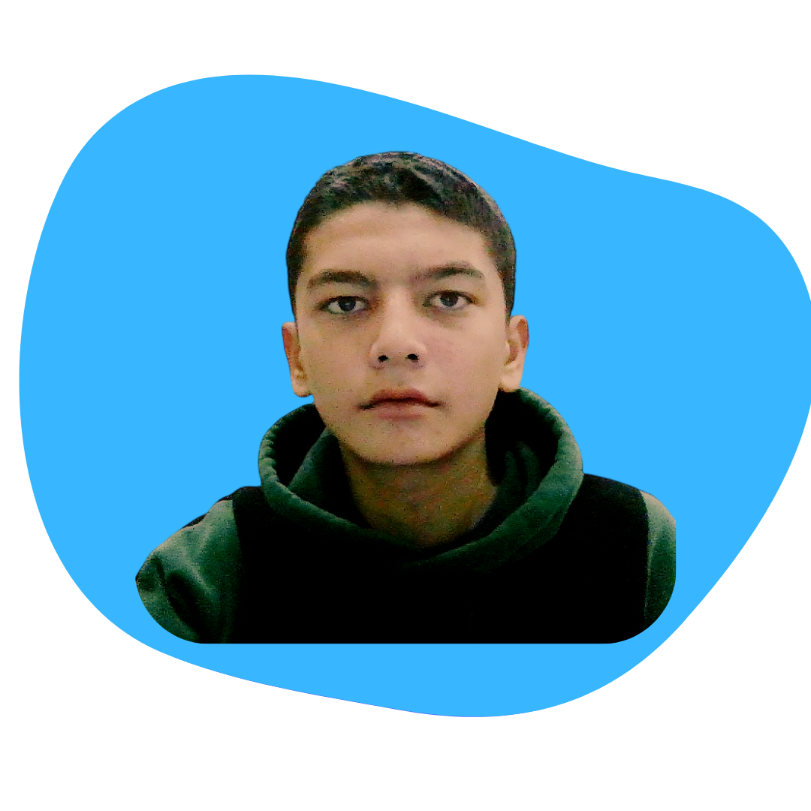
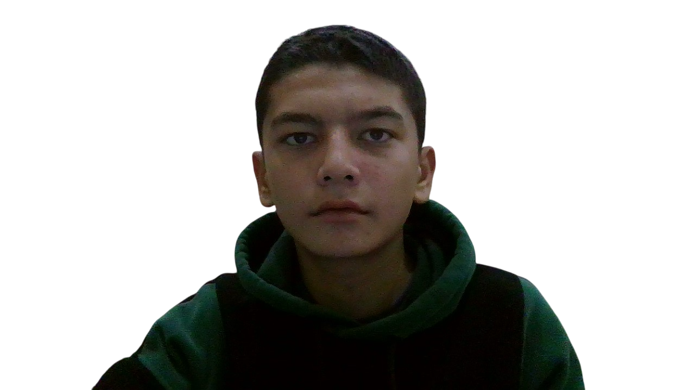

<!DOCTYPE html>
<html lang="en">
    <head>
        <meta charset="UTF-8">
        <meta name="viewport" content="width=device-width, initial-scale=1.0">
        <link href='https://unpkg.com/boxicons@2.1.4/css/boxicons.min.css' rel='stylesheet'>
        <title>Document</title>
        <link rel="stylesheet" href="portifolio.css">
    </head>
    <body>

        <header id="header">
            <nav>
                <a href="#home">Bosh sahifa</a>
                <a href="#about">Biz haqimizda</a>
                <a href="#services">Xizmatlar</a>
                <a href="#contact">Bog‘lanish</a>
            </nav>
        </header>
         
        <main>
            <section class="home_item" id="home">
                

                    

                        <h3>Hi,I am </h3>
                     
                    <h1>Tohirov  Abdulloh</h1>
                     
                    
Frontend and Mobile developer

                     
                     
                    <button type="submit"><a href="#">Resume</a></button>
                    

                    
                

                

                <button class="top"><a href="#home">Bosh sahifa</a></button>
            </section>,
            <section class="about_item" id="about">
                <h2>About me</h2>
                

                    

                        
                    

                

                    <h3>I'm Abdulloh</h3>
                    
Hello! My name is Abdulloh, and I’m a passionate Front-End Developer who loves turning ideas into beautiful and functional websites. I enjoy creating clean, modern, and responsive designs that provide a great user experience.
                     
                    I’m always learning new technologies to improve my skills — especially in HTML, CSS, JavaScript, and modern frameworks. Coding is not just my work; it’s something that inspires me to build and grow every single day.
                     
                    In my free time, I like experimenting with new design styles, exploring UI/UX trends, and working on personal projects. My goal is to become a professional front-end engineer and build websites that make a real impact.

                

                

                
            </section>
             
            <section class="skills">
                <h2>Skills</h2>
                

                    

                        
HTML

                        

                            
90%

                        

                        
CSS

                        

                            
80%

                        

                        
Bootstrap

                        

                            
65%

                        

                        
Python

                        

                            
60%

                        

                    

                

                

            </section>
            <section class="contact" id="contact">
                <h2>Contact</h2>
                <form action="">
                    <input type="text" placeholder="Name" required >
                     
                     
                    <input type="email" required placeholder="Email">
                     
                     
                    <textarea placeholder="Extra information" name="" id="" required></textarea>
                     
                     
                    <button type="submit" class="submit">Yuborish</button>
                </form>
                
            </section>
             
             
        </main>
        
        <footer>
            <h1 style="text-align: center;font-size: 3em;">Abdulloh</h1>
            
©2025 Abdulloh Tohirov. Copyright all right reserved

            <nav>
                <a href="#home" style="color: white;">Bosh sahifa</a>
                <a href="#about" style="color: white;">Biz haqimizda</a>
                <a href="#services" style="color: white;">Xizmatlar</a>
                <a href="#contact" style="color: white;">Bog‘lanish</a>
            </nav>
        </footer>
        
    </body>
</html>
